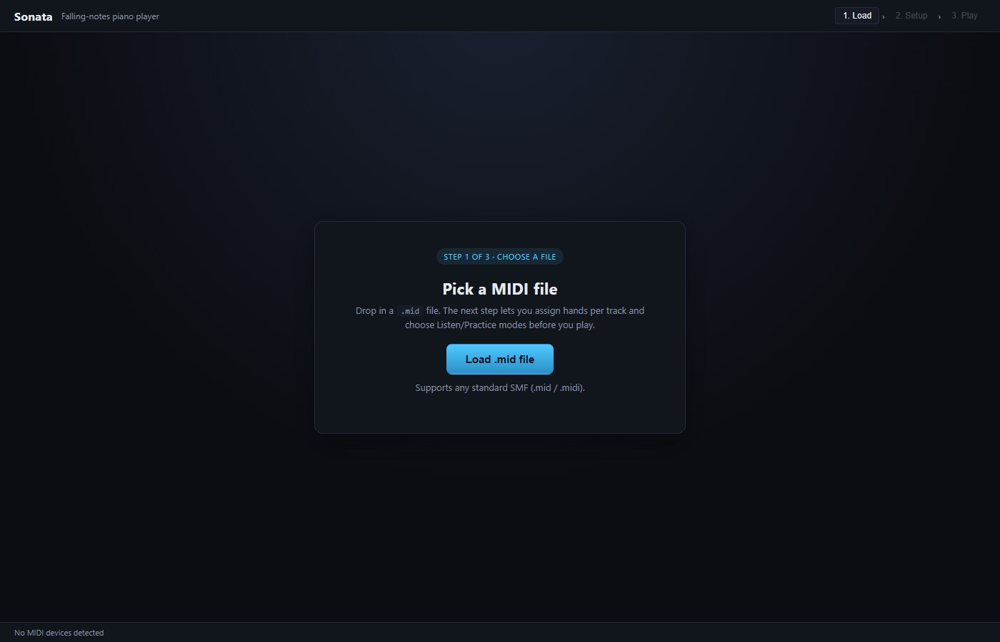
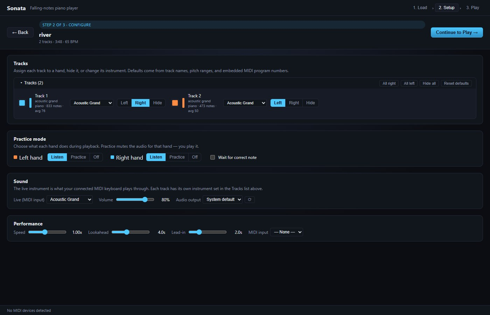
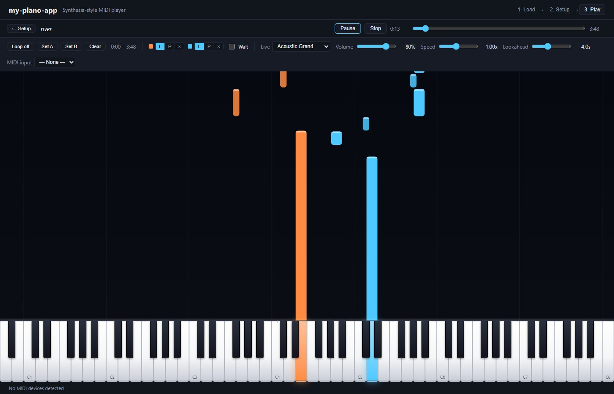
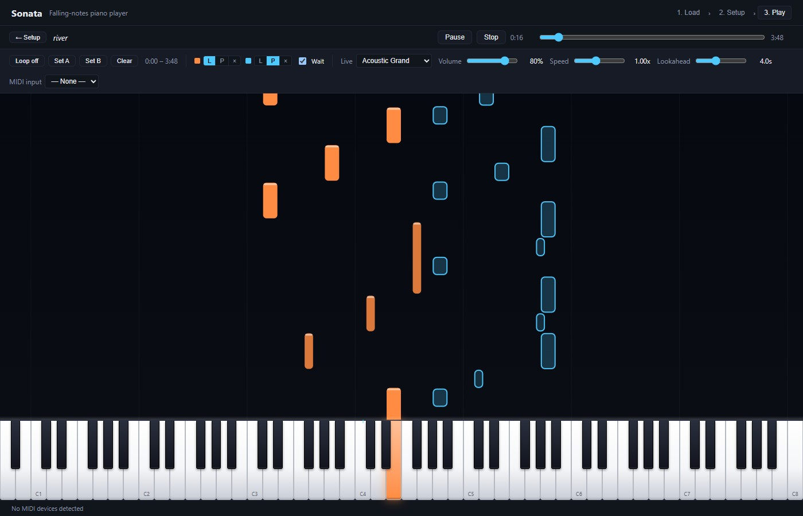

<p align="center">
  
</p>

# Sonata

Sonata is a desktop piano-practice app that turns MIDI files into an interactive falling-notes experience. Listen to a piece, isolate either hand, slow difficult passages down, loop a section, or connect a MIDI keyboard and practice until every note is right.

## Features

- Load standard `.mid` and `.midi` files.
- Visualize each track as falling notes over an 88-key piano.
- Assign tracks to the left hand, right hand, or hide them entirely.
- Set each hand to **Listen**, **Practice**, or **Off**.
- Pause playback until the correct practice notes are played.
- Connect a hardware piano through Web MIDI with live sound and key highlighting.
- Adjust playback speed, note lookahead, lead-in time, volume, and audio output.
- Create A/B loops for focused repetition.
- Choose instruments per track and a separate instrument for live MIDI input.
- Run as an Electron desktop app or in a supported browser.

## Screenshots

| Load a song | Configure your practice session |
| --- | --- |
|  |  |

| Follow the falling notes | Practice one hand at a time |
| --- | --- |
|  |  |

## Getting started

### Requirements

- [Node.js](https://nodejs.org/) and npm
- An internet connection the first time an instrument is loaded; audio samples are downloaded from hosted soundfont libraries
- Optional: a USB or Bluetooth MIDI keyboard

### Run in development

```bash
npm install
npm run dev
```

This starts Vite and opens the app in Electron. To run only the browser version at `http://127.0.0.1:5173`:

```bash
npm run dev:web
```

### Build the desktop app

```bash
npm run build
```

Installers are written to `release/`. For a faster unpacked development build, run:

```bash
npm run build:dir
```

## How to use

1. Load a MIDI file.
2. Review the detected tracks and assign each one to the left hand, right hand, or Off.
3. Choose how each hand behaves:
   - **Listen** plays and displays the part.
   - **Practice** displays the part without playing it for you.
   - **Off** hides and mutes the part.
4. Select a MIDI input if you are using a digital piano.
5. Continue to the play screen and start practicing.

Enable **Wait for correct note** to make Sonata pause at each practice note until you play the matching key. Use **Set A** and **Set B** to repeat a difficult section.

## Available scripts

| Command | Description |
| --- | --- |
| `npm run dev` | Start Vite and Electron together |
| `npm run dev:web` | Start the browser version |
| `npm run build:vite` | Type-check and build the renderer |
| `npm run build` | Build platform installers with electron-builder |
| `npm run build:dir` | Build an unpacked desktop application |
| `npm run start` | Open Electron using the latest production build |
| `npm run preview` | Preview the Vite production build |

## Built with

- [Electron](https://www.electronjs.org/)
- [React](https://react.dev/) and [TypeScript](https://www.typescriptlang.org/)
- [Vite](https://vite.dev/)
- [Tone.js](https://tonejs.github.io/) and [soundfont-player](https://github.com/danigb/soundfont-player)
- [@tonejs/midi](https://github.com/Tonejs/Midi)
- HTML Canvas and the Web MIDI API

## Audio notes

The acoustic grand uses the Salamander Grand sample set. Other instruments load from the MusyngKite General MIDI soundfont. Samples are cached by the browser after loading, but a newly selected instrument may require a short download before it can play.

For the lowest live-input latency, use the Electron app with a wired audio output. Bluetooth audio can add noticeable delay.
